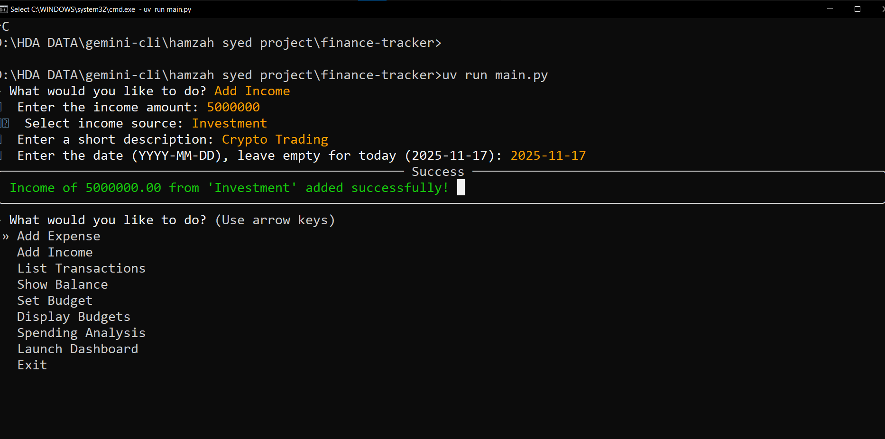
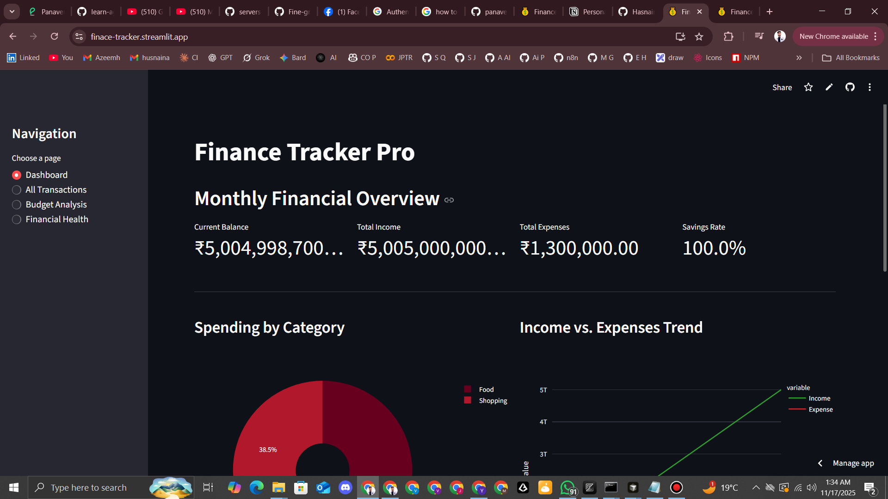

# 💰 Personal Finance Tracker CLI  
*A Spec-Driven Development (Spec-DD) Project built with Gemini CLI*  


---

## 🚀 Project Overview  

**Personal Finance Tracker CLI** is a command-line-based Fintech application that helps users manage their **expenses, income, budgets, and financial insights** — all directly from the terminal.  
This project was built entirely using **Spec-Driven Development (Spec-DD)** principles and **Gemini CLI**, meaning the entire codebase was generated and structured based on predefined specifications (`GEMINI.md` files).  

This project demonstrates how **AI-assisted tools** like Gemini CLI can turn clear documentation into working software — fast, structured, and reliable.

---

## 🧠 Core Idea  

> “Learn to code fintech applications while managing your own finances — using AI as your coding partner.”  

The goal was to experience the future of software engineering — **Spec-Driven Development**, where every feature is defined in documentation first, and then generated using AI tools.

---

## 🧩 Features  

### 💵 **1. Transaction Management**
- Add, view, and filter **income** and **expense** transactions  
- Supports multiple **categories** (Food, Transport, Shopping, Bills, etc.)  
- Color-coded **Rich tables** for clarity  
- Accurate **monthly balance** calculations  
- Secure money handling — all monetary values stored as integers (paisa/cents)

### 📊 **2. Budget Management**
- Set **monthly budgets** per category  
- Track **budget utilization** with color-coded progress bars  
- Get **alerts** for overspending  
- Automatic **monthly reset**

### 📈 **3. Financial Analytics**
- Analyze **spending patterns** and **top categories**  
- Calculate **burn rate**, **savings rate**, and **financial health score**  
- Compare current and previous months  
- Generate **financial reports** and **trends**

### 🤖 **4. Smart Recommendations & Alerts**
- **Daily financial summaries**  
- **Smart alerts** for unusual transactions  
- **AI-driven tips** to improve savings  
- **Goal tracking** for savings and emergency funds  

### 🗂️ **5. Data Management**
- **Export** data to CSV/JSON  
- **Import** transactions  
- **Auto-backup** system with timestamped archives  
- **Data validation** for accuracy and integrity  

### 🌐 **6. Web Dashboard (Streamlit)**
- Visual dashboard built with **Streamlit**  
- Displays:
  - Total income, expenses, and balance  
  - Budget progress (color-coded)  
  - Recent transactions  
- Clean, responsive, and modern UI  

---

## 🏗️ Project Structure  

```
finance-tracker/
├── main.py
├── database/
│   ├── transactions.txt
│   └── budgets.txt
├── features/
│   ├── transactions/
│   │   ├── GEMINI.md
│   │   └── transactions.py
│   ├── budgets/
│   │   ├── GEMINI.md
│   │   └── budgets.py
│   ├── analytics/
│   │   ├── GEMINI.md
│   │   └── analytics.py
│   ├── smart_assistant/
│   │   ├── GEMINI.md
│   │   └── smart_assistant.py
│   └── data_management/
│       ├── GEMINI.md
│       └── data_management.py
├── streamlit_app.py
└── README.md
```

---

## ⚙️ Tech Stack  

| Category | Technology Used |
|-----------|-----------------|
| **Language** | Python 3.11+ |
| **CLI Framework** | [Questionary](https://github.com/tmbo/questionary) |
| **UI Library** | [Rich](https://github.com/Textualize/rich) |
| **Package Manager** | [UV](https://astral.sh/uv) |
| **AI Tool** | [Gemini CLI](https://github.com/google/gemini-cli) |
| **Dashboard** | [Streamlit](https://streamlit.io/) |

---

## 🧰 Installation & Setup  

### 1️⃣ **Clone the Repository**
```bash
git clone https://github.com/HasnainCodeHub/finance-tracker
cd finance-tracker
```

### 2️⃣ **Install UV (Python Environment Manager)**
```bash
pip install uv
```
or (PowerShell):
```bash
powershell -ExecutionPolicy ByPass -c "irm https://astral.sh/uv/install.ps1 | iex"
```

### 3️⃣ **Setup Virtual Environment**
```bash
uv init
uv venv
.venv\Scripts\activate  # Windows
source .venv/bin/activate  # Linux/Mac
```

### 4️⃣ **Install Dependencies**
```bash
uv add rich questionary streamlit
```

### 5️⃣ **Run the CLI App**
```bash
python main.py
```

### 6️⃣ **Run the Web Dashboard**
```bash
streamlit run streamlit_app.py
```

---

## 🧠 Fintech Concepts Implemented  

| Concept | Description |
|----------|-------------|
| **Transaction** | Any flow of money (debit or credit) |
| **Budget** | Planned spending limit for a category |
| **Savings Rate** | % of income saved |
| **Burn Rate** | Average daily spending |
| **Financial Health Score** | Calculated score (0–100) based on savings, budgets, and expenses |

---

## 💡 Spec-Driven Development (Spec-DD) Workflow  

Each feature has its own `GEMINI.md` file containing:
- Feature goals  
- Fintech concepts  
- Flow design  
- Success criteria  
- Prompts for AI code generation  

Then Gemini CLI is used to build the project automatically:  

```bash
gemini
> "Read all gemini.md and initialize my project and build its structure."
```

Example:
```bash
gemini
> "Add budget features @features/budget/GEMINI.md"
```

---

## 📸 Screenshots  

| CLI Interface | Web Dashboard |
|----------------|----------------|
|  |  |


---

## 🎯 Learning Outcomes  

- Learned **Spec-Driven Development (Spec-DD)**  
- Used **AI-assisted coding** for structured development  
- Built a complete **Fintech CLI + Dashboard** system  
- Understood **financial analytics** and **budget management** logic  
- Delivered a **fully functional project** in a live challenge within **20 minutes**  

---

## 🏫 Academic Context  

This project was built as part of the **Panaversity / PIAIC Fintech Live Class** challenge.  

> In a live session of **500+ students**, this project was the **first one to be completed and demonstrated successfully**.  

**Mentor:** Zia Khan  
**Instructor:** Sir Muhammad Qasim  

---

## 🧑‍💻 Author  

**Hamzah Syed**  
AI & Fintech Student | PIAIC / Panaversity  

📫 Connect with me:  
- 🌐 [LinkedIn](https://www.linkedin.com/in/hasnain-ali-developer/)  
- 🐙 [GitHub](https://github.com/HasnainCodeHub)  

---
## Developed By
**Hasnain Ali Azeem**

---

## 🪪 License  

This project is licensed under the **MIT License**.  
Feel free to use, modify, and share it for educational or professional purposes.  

---

## 🌟 Acknowledgements  

A huge thanks to **Sir Muhammad Qasim**, **Zia Khan**, and the **Panaversity Team** for introducing and guiding us through **Spec-Driven Development** using **Gemini CLI**.  

> “Code less, think more — let specs and AI handle the rest.” 🚀
